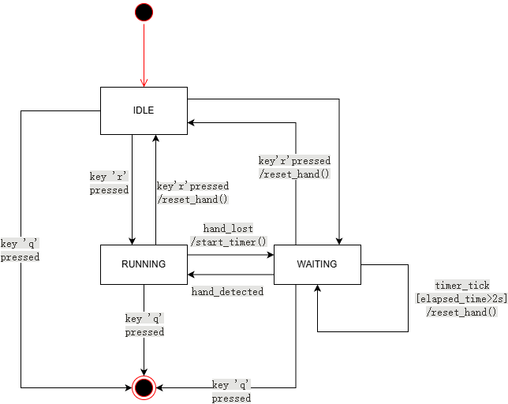
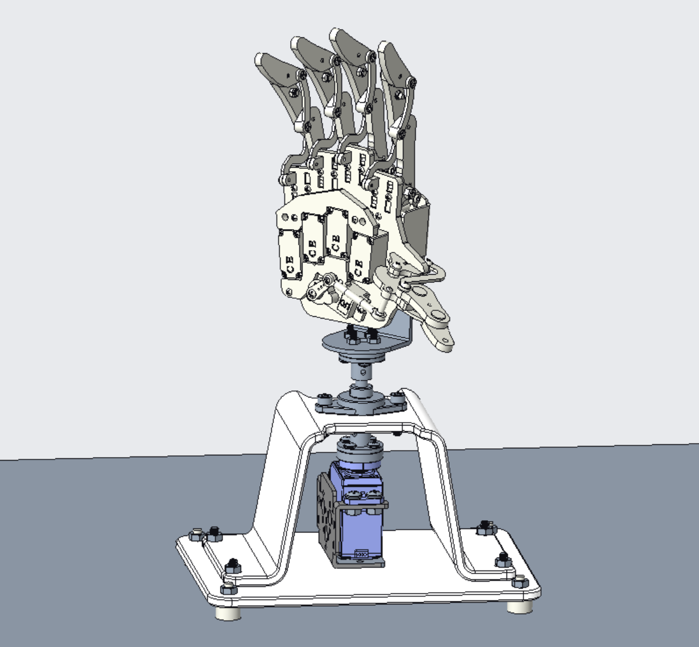
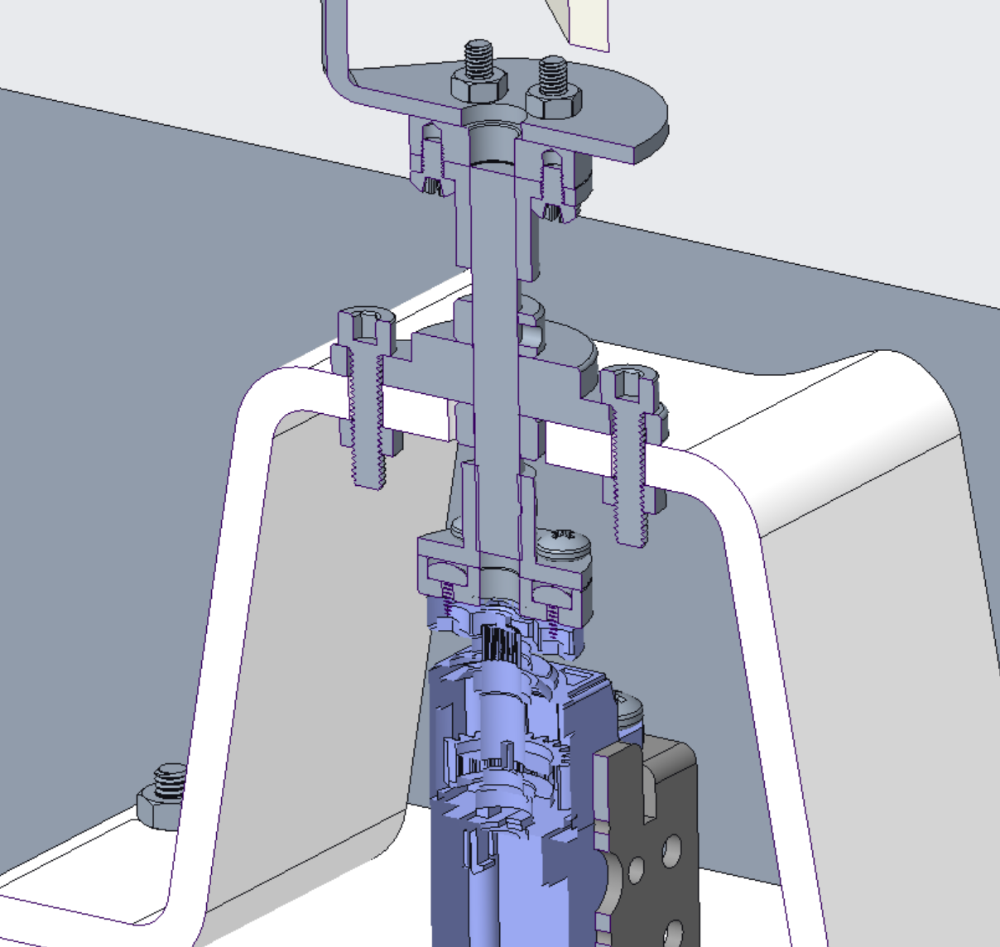
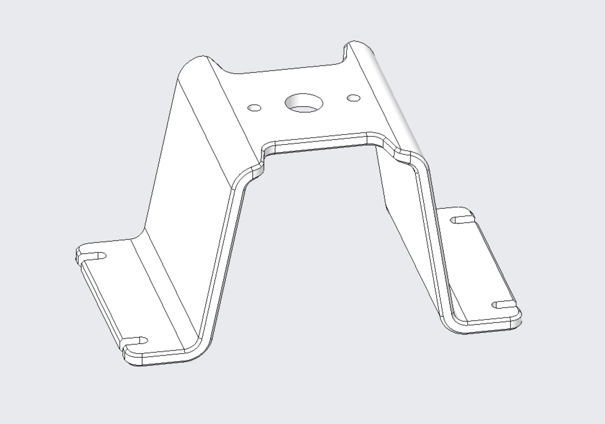

# Vision-Controlled Bionic Hand

[](https://github.com/VincentWen073/vision-controlled-bionic-hand/actions/workflows/python_ci.yml)

An open-source project that uses real-time hand tracking to control a bionic hand. This project is built with Python on a Raspberry Pi, utilizing MediaPipe for gesture recognition and serial communication for hardware control.


---

## Demonstration


---

## Features

- **Real-time Hand Tracking**: High-performance hand landmark detection using Google's MediaPipe on Raspberry Pi.
- **State Machine Control**: A robust state machine (IDLE, RUNNING, WAITING) manages the application logic for reliability.
- **Dynamic Pose Calibration**: Automatically sets the initial hand pose as the "zero point" for intuitive relative control of the wrist.
- **Smooth Servo Motion**: Implements an EMA (Exponential Moving Average) filter to smooth servo angle commands, resulting in fluid movements.
- **Real-Time Embedded System**: Firmware built on FreeRTOS, featuring a multi-tasking architecture for robust, scalable, and real-time control.
- **Reliable Serial Protocol**: A custom serial protocol with a checksum ensures data integrity between the Raspberry Pi and the microcontroller.
- **Python-based**: The entire high-level logic is written in Python, making it easy to read and extend.

---

## Tech Stack

### Hardware

- **Host Computer**: Raspberry Pi 5
- **Camera**: Raspberry Pi Camera Module v1 (OV5647 Sensor)
- **Robotic Hand Assembly**: 6-DOF Robotic Arm Kit with:
  - 5x LFD-01 Servos (Fingers)
  - 1x LD-1501MG Servo (Wrist Rotation)
- **Servo Driver**: 8-Channel Servo Controller Board
- **Microcontroller**: STM32 NUCLEO F446RE (acts as a bridge between Pi and servo driver)

### Software
- **OS**: Raspberry Pi OS (64-bit recommended for MediaPipe), FreeRTOS (on STM32)
- **Core Frameworks**:
  - **Python 3.9+**
  - **C/C++** (for STM32 Firmware)
  - **OpenCV** for video processing.
  - **MediaPipe** for hand landmark detection.
  - **Picamera2** for modern camera interfacing on Raspberry Pi.
  - **PySerial** for serial communication.
  - **NumPy** for numerical operations.
- **Dev Tools**:
  - **Pytest** for unit testing.
  - **Black** & **Ruff** for code formatting and linting.
  - **GitHub Actions** for Continuous Integration (CI).

---

## Project Structure

```
.
├── .github/workflows/        # CI workflow configuration
├── cad/                      # CAD models of Mechanical Assembly
├── docs/                     # Images and BOM
├── firmware/                 # firmware of driver code on STM32
├── models/                   # MediaPipe model files
├── src/                      # Main source code
│   ├── communication/        # Serial communication module
│   ├── kinematics/           # Kinematics and angle calculation logic
│   ├── visualization/        # OpenCV drawing utilities
│   └── main.py               # Main application entry point
├── tests/                    # Unit tests for the project
├── requirements.txt          # Python dependencies
└── README.md                 # This file
```

---

## Software Architecture

The project's software is split into two main components: a high-level application running on the Raspberry Pi, and a real-time firmware on the STM32 microcontroller.

### High-Level Control (Raspberry Pi)

The main Python application's logic is managed by a robust finite state machine (FSM) to ensure predictable and reliable operation. The state transitions are triggered by user input and hand detection events.

**State Machine Diagram (UML):**



- **IDLE**: The initial state. The system is waiting for user command and performs no hand tracking.
- **RUNNING**: The active state. The application continuously processes camera frames, calculates servo angles, and sends them to the STM32.
- **WAITING**: A transitional state entered when a hand is lost. If the hand is not re-detected within a timeout, the system resets the robotic hand's pose.

### Real-Time Firmware (STM32)

The embedded firmware is built upon the **FreeRTOS** real-time operating system to handle time-critical tasks reliably.

- **Multi-Tasking Design**: The firmware is architected with two primary tasks:
    1.  A **`uartReceiveTask`** for handling incoming serial data asynchronously.
    2.  A **`servoControlTask`** for updating all 6 servo PWM signals in real-time.
- **Thread-Safe Communication**: A **Message Queue** is used to safely pass angle commands from the receiving task to the control task, preventing data corruption and ensuring smooth motion.

---

## Installation & Usage

### 1. Hardware Setup


**1. Camera Connection:**
   - Connect the **Pi Camera Module** to the Raspberry Pi's CSI port using the ribbon cable.

**2. Power Distribution:**
   - **CRITICAL**: Provide a separate, stable **5V-6V power supply** with sufficient current (e.g., 5A or more) for the **servo driver board's motor power input (VM)**.
   - **DO NOT** power the servos or the driver board from the Raspberry Pi's 5V pin.
   - Ensure a **common ground (`GND`)** is connected between the Raspberry Pi, the STM32, and the servo power supply.

**3. Control Signal Wiring:**
   - The control path is: `Raspberry Pi -> STM32 -> Servo Driver Board -> Servos`.

**Part A: Raspberry Pi to STM32 (Serial Communication)**

This connection is for sending angle commands from the high-level controller (Pi) to the low-level actuator controller (STM32).

| From Raspberry Pi | Pin Name    | To STM32    | Pin Name | Purpose                 |
| :---------------- | :---------- | :---------- | :------- | :---------------------- |
| Pin 6             | **GND**     | Any **GND** Pin | GND      | Common Ground Reference |
| Pin 8             | **TXD** (GPIO 14) | Pin **D2**      | RXD      | Serial Data to STM32    |
| Pin 10            | **RXD** (GPIO 15) | Pin **D8**      | TXD      | Serial Data from STM32  |

**Part B: STM32 to 8-Channel Servo Driver Board (PWM Control)**

This connection sends the final PWM signals from the STM32's timers to the servo driver channels.

| From STM32 Pin | To Servo Driver Channel Input | Controlled Servo     |
| :------------- | :---------------------------- | :------------------- |
| **GND**        | **GND**                       | ---                  |
| **PA7**        | Channel **0**                 | Wrist Rotation Servo |
| **PA0**        | Channel **1**                 | Thumb Servo          |
| **PA1**        | Channel **2**                 | Index Finger Servo   |
| **PB10**       | Channel **3**                 | Middle Finger Servo  |
| **PB2**        | Channel **4**                 | Ring Finger Servo    |
| **PA6**        | Channel **5**                 | Pinky Finger Servo   |


### 2. Mechanical Design & Assembly

The support structure and wrist rotation mechanism for the bionic hand were custom-designed to provide a stable and precise platform for the actuator. The components were modeled in Creo 10.0, focusing on integrating standard machine elements with 3D-printed parts for a robust and reliable assembly.

| Component                 | Image                                               | Design Highlights                                                                                                                               |
| :------------------------ | :-------------------------------------------------- | :---------------------------------------------------------------------------------------------------------------------------------------------- |
| **Full Mechanical Assembly** |  | • A modular design allowing the hand, wrist, and base to be assembled independently.<br>• Compact layout to maximize the range of motion.        |
| **Wrist Rotation Joint**    |      | • **Pillow block bearing** provides robust radial support and simplifies alignment.<br>• **Shaft collars** are used for precise axial positioning of the main shaft.<br>• Torque is transmitted reliably from the servo via a flange coupling. |
| **A-Frame Support Base**    |                    | • A wide A-frame structure offers **excellent stability** against tipping during operation.<br>• Features an **integrated servo mount** that protects the actuator and optimizes space.<br>• Designed with precise mounting points for the pillow block bearing and fasteners. |

*Note: The hand assembly is a third-party kit, while the base, wrist joint, and all supporting structures were custom-designed for this project.*

### 3. Software Environment

**Clone the repository:**
```bash
git clone https://github.com/VincentWen073/vision-controlled-bionic-hand.git
cd vision-controlled-bionic-hand
```

**Create and activate a virtual environment (recommended):**
```bash
python3 -m venv .venv
source .venv/bin/activate
```

**Install dependencies from `requirements.txt`:**
```bash
pip install -r requirements.txt
```

### 4. Run the Application

Once the setup is complete, run the main script from the project's root directory:

```bash
python -m src.main
```

### Controls
- **`r` key**: Press to toggle the hand recognition state (IDLE <-> RUNNING).
- **`q` key**: Press to quit the application.

---

## Testing

This project uses `pytest` for unit testing the core kinematic functions. To run the tests, execute the following command from the root directory:

```bash
pytest -v
```
